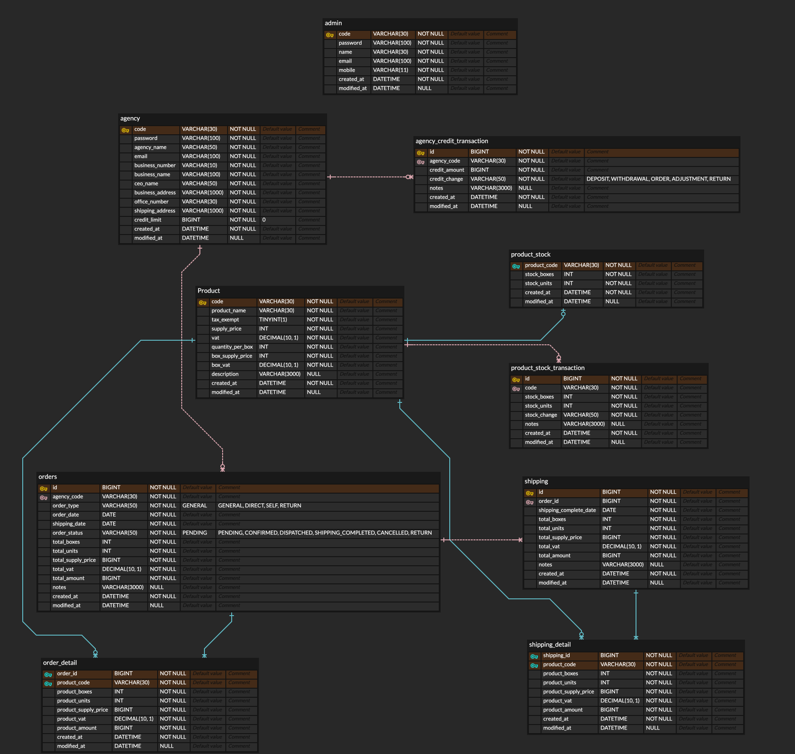

# 🚚 물류 시스템

---

#### 대리점, 제품, 입 / 출고 등 물류의 기본 기능을 갖춘 시스템 구현
 

## 프로젝트 기능 및 설계

---

#### 인증 / 인가 기능
- 관리자 / 대리점 계정 생성
  - 관리자 및 대리점 계정을 생성할 수 있다. 단 물류 관리자만 대리점 계정을 생성할 수 있다.
- 로그인
  - 관리자 / 대리점 코드와 비밀번호로 로그인 가능하다.

#### 제품 관리 기능
- 제품 등록 / 수정
  - 제품을 등록하고 제품 정보를 수정할 수 있으며, 등록 시 제품의 기초 재고 정보도 함께 입력할 수 있다.

#### 여신 관리 기능
- 대리점 여신 등록 / 수정
  - 관리자가 대리점의 여신을 등록, 수정할 수 있다.
- 여신 변경 이력 관리
  - 대리점의 여신 변경 이력을 관리하여 입금, 주문, 반품 등 여신에 영향을 미치는 사항을 추적 관리할 수 있다.

#### 물류 기능
- 재고 관리
  - 시스템에 등록된 제품의 재고를 관리한다.
  - 제품 입/출고, 반입 등에 따른 재고 변경 이력을 저장하여 추척 관리할 수 있다.
- 주문 관리
  - 주문 등록
    - 관리자 : 주문 마감 시간 이후 에도 관리자는 필요에 따라 주문 수정이 가능하다.
    - 대리점 : 주문 마감 시간 전에만 주문 수정이 가능하다.
  - 주문 조정
    - 주문 마감 시간 후 관리자는 총 주문 수량과  재고를 파악하여 조정이 필요한 경우 주문 수정을 진행한다.
  - 주문 확정
    - 주문 조정이 완료된 후 대리점의 주문 상태를 확정 상태로 변경한다.
    - 조정이 발생해 금액 변동이 있는 경우 확정 시점 여신에 반영된다.
  - 주문 마감 시간 관리
    - 주문 마감 시간의 기본값은 출고일 전날 16:00이며 관리자는 필요에 따라 시간을 조정할 수 있다.
- 배차 관리
  - 주문이 확정된 후 주문 상태를 배차로 변경한다. 배차 처리와 관련된 내용은 이 시스템에서 실제로 수행되지 않으며, 외부 시스템 또는 프로세스에서 이를 처리되는 것으로 가정한다.
- 출고 관리
  - 배차가 확정된 후 주문 상태를 출고로 변경한다.
  - 출고 후 미착, 회송, 오착의 경우 해당 주문의 출고 내역을 수정할 수 있으며 금액 변동이 일어난 경우 수정 내역 저장 후 여신에 반영된다.
- 반품 관리
  - 대리점 반품 시 반품 주문을 등록하여 재고, 여신에 반품으로 인한 변동 금액을 반영할 수 있다.

#### 조회 기능
- 제품 조회
  - 제품 코드, 제품명으로 검색해 제품 정보를 확인할 수 있다.
  - 단 대리점은 제품 코드와 제품명만 확인이 가능하다.
- 재고 조회
  - 제품 코드, 제품명으로 검색이 가능하며 관리자만 재고 현황을 확인할 수 있다.
- 주문 / 출고 조회
  - 기간별, 특정 날짜 별로 검색해 해당 기간의 주문 / 출고 내역을 확인할 수 있다.
- 대리점 조회
  - 대리점 코드, 대리점명으로 검색해 대리점 정보를 확인할 수 있다.
  

## ERD

---

 

## API 문서

---

<i>스웨거 문서 업데이트 예정</i>
  

## Tech Stack

---

  